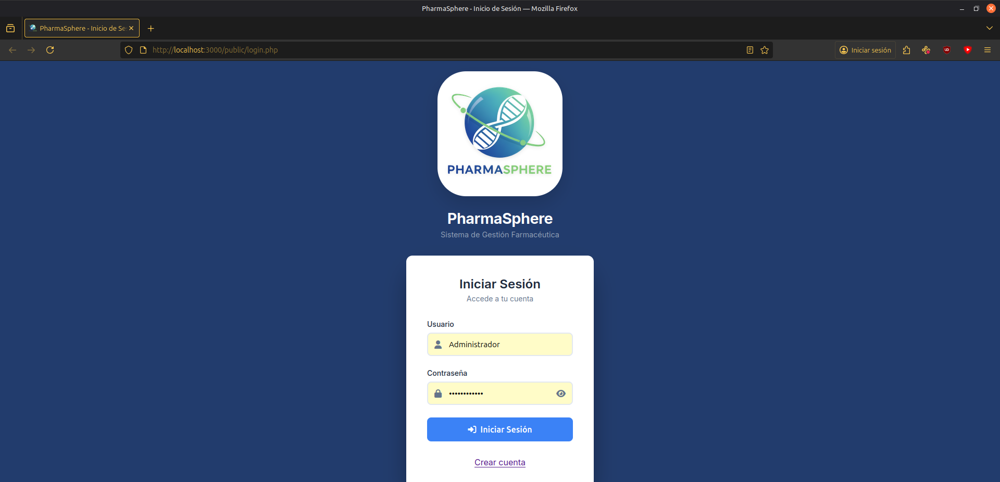

# 💊 PharmaSphere

PharmaSphere es una aplicación web integral para la gestión de inventario farmacéutico. El proyecto implementa un sistema de control de stock, gestión de proveedores y administración de usuarios, destacando por su seguridad, uso de transacciones SQL y personalización de interfaz mediante Cookies.

## 👥 Autores

Este proyecto ha sido realizado por:

- Javier Muñoz Conesa
- Mark Blázquez Riera  
- Alejandro Aledo García

## 🚀 Instalación y Puesta en Marcha

Sigue estos pasos para desplegar la aplicación en tu entorno local (XAMPP, WAMP, LAMP, etc.):

### 1. Base de Datos

- Accede a tu gestor de base de datos (ej. phpMyAdmin)
- **Importa el script `schema.sql`**: Creará la base de datos `pharmasphere_db` y las tablas necesarias (USUARIO, PRODUCTO, MARCA, AUDITORIA, etc.)
- **Importa el script `seed.sql`**: Cargará los datos de prueba, incluyendo marcas, proveedores y 50 productos iniciales

### 2. Configuración de Conexión

Asegúrate de que las credenciales en `app/pdo.php` coinciden con tu servidor MySQL. Por defecto, el proyecto intenta conectar con:

```php
// app/pdo.php
$host = "localhost";
$db   = "pharmasphere_db";
$user = "admin_pharma";      // Usuario creado por el script
$pass = "Admin_IAW_pharma";  // Contraseña definida
```


## 3. Acceso al Sistema

El sistema cuenta con un usuario administrador pre-creado en el archivo `seed.sql`:

- **Usuario:** Administrador
- **Rol:** Administrador

## 📖 Manual de Uso y Funcionalidades

A continuación se detallan los flujos principales de la aplicación junto con las capturas de pantalla del funcionamiento.

### 🔐 1. Autenticación, Registro y Seguridad

El sistema protege todas las rutas internas utilizando `require_login()` en `auth.php`. Si no existe sesión activa, se impide el acceso.

- **Login:** Verifica credenciales de forma segura usando `password_verify`
- **Registro:** Permite a nuevos usuarios crear cuenta, asignando por defecto el rol de 'Usuario'
- **Gestión de Usuarios (Admin):** Los administradores pueden gestionar usuarios y roles desde el panel interno

**Pantalla de Inicio de Sesión:**  


**Prueba de Redirección:** Al intentar entrar directamente a `index.php` o `items_list.php` sin loguearse, el sistema redirige forzosamente al login.  
![Redirect Logic][captura]

### 📋 2. Gestión de Productos (Listado)

El módulo principal (`items_list.php`) implementa lógica de paginación y búsqueda en tiempo real utilizando `utils.php`.

- **Roles:** Los botones de "Editar/Borrar" solo aparecen para Administradores; los usuarios ven "Añadir al carrito"
- **Indicadores Visuales de Stock:** Se implementa un semáforo visual mediante clases CSS en `style.php`:
  - 🔴 **Bajo:** ≤ 50 unidades (`stock-low`)
  - 🟠 **Medio:** ≤ 150 unidades (`stock-med`)
  - 🟢 **Alto:** > 150 unidades (`stock-high`)

**Listado con Paginación y Búsqueda Activa:**  
![Product List][captura]

### 🔍 3. Ficha Técnica (Detalle del Producto)

La vista `items_show.php` ofrece un detalle profundo del producto seleccionado.

- **Barra de Progreso:** Visualiza gráficamente el stock disponible respecto a un máximo de referencia (250 u.)
- **Receta Médica:** Muestra iconos de advertencia y mensajes específicos si el producto requiere receta (`RECETA = TRUE`)

**Vista de Detalle:**  
![Detail View][captura]

### ⚠️ 4. Alta, Edición y Validación

El formulario `items_form.php` maneja tanto la creación como la edición de productos. Incluye validaciones robustas tanto en cliente como en servidor.

- **Reglas:** El precio y el stock no pueden ser negativos, y es obligatorio seleccionar una marca
- **Feedback:** Si hay errores, se muestran alertas estilizadas y no se guarda el registro

**Formulario mostrando errores de validación:**  
![Form Errors][captura]

### 🔄 5. Auditoría y Transacciones (Rollback)

El sistema utiliza transacciones PDO (`beginTransaction`, `commit`, `rollBack`) para asegurar la integridad de los datos durante el borrado de productos en `items_delete.php`.

- **Auditoría:** Antes de borrar, se exige un motivo obligatorio que se guardará en la tabla `AUDITORIA` junto con el JSON del producto eliminado
- **Prueba de Rollback:** El sistema permite simular un fallo durante el borrado. Gracias a la transacción, si ocurre un error, el producto NO se elimina y la base de datos vuelve a su estado original

**Detalle de Auditoría (Solicitud de Motivo):**  
![Detalle Auditoria][captura]

**Prueba de Rollback (Simulación de fallo):**  
![Prueba de Rollback][captura]

### 🎨 6. Personalización (Cookies)

A través de `preferencias.php`, el usuario puede personalizar la apariencia. Estas preferencias se almacenan en cookies persistentes (30 días), permitiendo que la configuración se mantenga entre sesiones.

- **Opciones:** Tema (Claro/Oscuro) y Tamaño de Fuente (Normal/Grande)

**Cookie Aplicada (Tema Oscuro):**  
![Tema Oscuro con Cookie][captura]